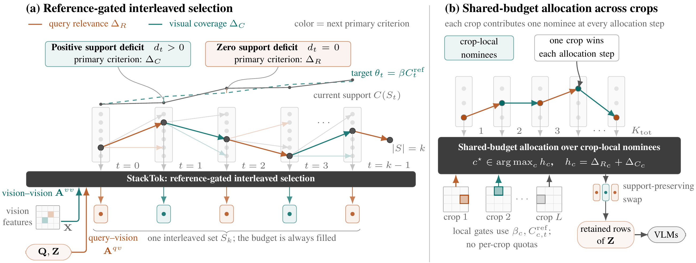

# StackTok

Code for **StackTok: Accelerating VLMs Inference with Budget-Adaptive Visual Token Selection**.

StackTok provides budget-adaptive visual token selection for vision-language models. This repository includes the core selector, integrations for LLaVA and Qwen2.5-VL, and adapters for evaluation with `lmms-eval`.

## Framework

[](docs/images/framework.pdf)

A size-indexed support target gates relevance-oriented and coverage-oriented token selection. High-resolution crops share a token budget, followed by optional support-preserving swap refinement. Click the figure to view the original PDF from the paper.

## Contents

```text
stacktok/
  core/       selector and runtime integration
  llava/      LLaVA injection and multi-crop handling
  qwen/       Qwen2.5-VL injection
adapters/     lmms-eval model adapters
scripts/      adapter installer
tests/        deterministic selector tests
docs/images/  framework figure from the paper
```

## Environment Setup

Python 3.10 or later is required. Clone the repository and enter its root directory:

```bash
git clone https://github.com/wongzbb/StackToK.git
cd StackToK
```

Core package and tests:

```bash
python -m pip install -e '.[test]'
pytest -q
```

Qwen2.5-VL integration:

```bash
python -m pip install -e '.[qwen]'
```

Evaluation adapters:

```bash
python -m pip install -e '.[eval,qwen]'
python scripts/install_lmms_adapters.py
```

The adapter installer writes two model modules into the active `lmms_eval` installation and adds idempotent registry entries.

## Core Usage

```python
import torch

from stacktok import StackTokSelector

selector = StackTokSelector(
    target_vision_tokens=64,
    beta_min=0.3,
    beta_max=0.9,
    swap_mode="auto",
)

indices, selected_tokens, diagnostics = selector.stacktok_single(
    text_token_embedding=torch.randn(8, 4096),
    vision_tokens=torch.randn(576, 4096),
    vision_tokens_clip=torch.randn(576, 1024),
)
```

## Evaluation with lmms-eval

Install the adapters first, then provide the checkpoint explicitly.

LLaVA:

```bash
MODEL_PATH=/path/to/llava-checkpoint
lmms-eval eval \
  --model llava_stacktok \
  --model_args "pretrained=${MODEL_PATH},target_vision_tokens=64,stacktok_swap_mode=auto" \
  --tasks TASK_NAME \
  --batch_size 1 \
  --output_path OUTPUT_DIRECTORY
```

Qwen2.5-VL:

```bash
MODEL_PATH=/path/to/qwen-checkpoint
lmms-eval eval \
  --model qwen2_5_vl_stacktok \
  --model_args "pretrained=${MODEL_PATH},retain_ratio=0.2,stacktok_swap_mode=auto" \
  --tasks TASK_NAME \
  --batch_size 1 \
  --output_path OUTPUT_DIRECTORY
```

## Parameters

- `target_vision_tokens`: fixed budget used by LLaVA and the total budget for multi-crop allocation.
- `retain_ratio`: dynamic-resolution budget used by Qwen2.5-VL.
- `stacktok_tv_temperature`: text-to-vision softmax temperature.
- `stacktok_vv_temperature`: vision-to-vision softmax temperature.
- `stacktok_beta_min`, `stacktok_beta_max`: entropy-derived stability bounds.
- `stacktok_swap_mode`: `auto`, `true`, or `false`.
- `stacktok_epsilon_swap`: minimum relative improvement for a swap.
- `stacktok_swap_passes`: maximum local-search passes.
- `stacktok_swap_auto_max_k`: largest crop budget refined in `auto` mode.
- `stacktok_global_multicrop`: enables Algorithm B in the LLaVA integration.
